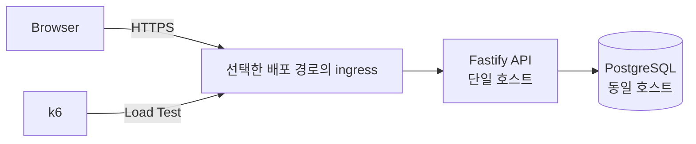

# HourBoard 프로젝트 기획서

## 1. 프로젝트 정의

- **프로젝트명:** HourBoard
- **사이트명:** 한시간동안 띄워드립니다
- **GitHub Repository:** `hourboard`
- **한 줄 설명:** 매 정각 가장 먼저 등록된 한 문구를 한 시간 동안 노출하고, 첫 등록 후 10초 안의 참가자에게 서버 처리 기준 순위를 반환하는 선착순 동시성 실험 서비스

HourBoard는 정각에 동시에 몰리는 요청을 하나의 시간 슬롯에 경쟁시키는 웹 서비스다. 가장 먼저 처리된 요청의 문구만 해당 시간의 전광판을 차지한다. 이후 요청은 전광판을 변경하지 못하며 자신이 몇 번째로 처리되었는지 즉시 확인한다.

사용자에게는 정각 티켓팅 연습 서비스로 보이고, 개발 관점에서는 동일 자원을 동시에 선점하는 요청의 정합성·순서·성능을 검증하는 프로젝트다.

---

## 2. 핵심 규칙

1. 한 라운드는 매시 정각에 시작하고 1시간 동안 유지한다.
2. 라운드 시작 전에 사용자는 문구를 미리 입력할 수 있다.
3. 등록 요청은 목표 시간 슬롯이 실제로 시작된 뒤에만 허용한다.
4. 해당 슬롯에서 PostgreSQL이 처음 확정한 요청 1건만 승자가 된다.
5. 승자의 문구는 다음 정각 전까지 전광판에 노출한다.
6. 첫 등록 전에는 등록을 허용하고, 첫 정상 등록부터 10초 미만 동안만 후속 등록을 허용한다.
7. 모든 성공 요청은 `1, 2, 3 ... N` 형태의 고유 순위를 받는다.
8. 순위 기준은 브라우저 클릭 시각이 아니라 서버와 PostgreSQL이 요청을 처리한 순서다.
9. 한 HTTP 등록 요청을 한 번의 도전으로 취급한다.
10. 초기 버전은 로그인, 사용자 계정, 과거 순위 복구를 제공하지 않는다.
11. 전광판 문구에는 HTML을 허용하지 않고 일반 문자열만 저장·출력한다.

### 사용자 문구

**1등**

> 축하합니다!
> 가장 먼저 등록하셨습니다.
> 작성하신 문구를 다음 정각까지 띄워드립니다.

**2등 이후**

> 아쉽군요!
> {position}번째로 등록하셨습니다!

---

## 3. 목표

### 제품 목표

- 정각 선착순 경쟁을 누구나 바로 이해할 수 있는 단순한 웹 서비스 제공
- 현재 전광판 문구와 남은 표시 시간을 명확하게 노출
- 등록 직후 사용자의 처리 순위를 즉시 반환
- 모바일 환경에서도 별도 설명 없이 사용할 수 있는 티켓팅 연습 UX 제공

### 기술 목표

- 동시에 들어온 요청에서 승자를 정확히 1명만 확정
- 모든 처리 성공 요청에 중복 없는 순번 부여
- hot path의 DB 접근을 등록 요청당 1회로 제한
- API 서버와 PostgreSQL을 동일 서버에 배치해 외부 DB RTT 제거
- PostgreSQL row contention과 atomic UPSERT 동작 직접 검증
- 동시 요청 증가에 따른 p50 / p95 / p99 latency 변화 측정
- E2E 부하 테스트 결과를 반복 가능한 아티팩트로 저장

---

## 4. 범위 제외

초기 프로젝트 범위에 포함하지 않는다.

- 회원가입 및 로그인
- 소셜 로그인
- 사용자 프로필
- 과거 도전 기록 조회
- 사용자별 중복 등록 제한
- 관리자 페이지
- Redis
- 메시지 큐
- 다중 API 서버 인스턴스
- 별도 managed database
- WebSocket 기반 채팅
- 결제
- 광고
- 알림
- AI 기능

범위 추가는 기획 변경으로 취급하고 `.project/plan.md`를 먼저 수정한다.

---

## 5. 기술 스택

| 영역 | 선택 | 기준 |
| --- | --- | --- |
| Runtime | Node.js 24 LTS | 안정 LTS 사용 |
| Language | TypeScript | 서버·브라우저 공통 타입 관리 |
| Backend | Fastify 5.x | 낮은 오버헤드, JSON Schema 기반 검증 |
| Database | PostgreSQL 18.x | UPSERT, row locking, MVCC 기반 동시성 검증 |
| Infrastructure | 단일 호스트 | OCI Linux VM 또는 Windows 11 미니PC + Docker Desktop |
| 배포 위치 | OCI Japan East (Tokyo) 또는 자체 호스팅 | 실제 배포 환경을 결과에 명시 |
| Load Test | k6 | Registration Race, polling, Thundering Herd 및 latency 측정 |
| Process | OCI: systemd / 미니PC: Docker Desktop | 선택한 경로의 재시작·reboot 복구 검증 |

### 버전 정책

- prerelease 버전 사용 금지
- PostgreSQL 19 Beta 계열 사용 금지
- 구현 시작 시 안정 버전의 최신 patch/minor를 확인한 뒤 고정
- lock file 갱신은 사용자 승인 이후 수행

---

## 6. 인프라 구조

### 배치 원칙

- OCI Always Free Compute는 계정 home region에서 생성
- OCI 시도는 현재 계정 home region인 Japan East (Tokyo) 기준
- OCI를 재시도할 때 공식 문서와 Console에서 무료 조건을 확인하고 유료 shape로 임의 변경하지 않음
- Tokyo A1 capacity 부족에 따라 Phase 4B 기본 경로는 자체 호스팅 미니PC + DuckDNS + Traefik으로 선택
- Phase 4B 운영 주소는 `hourboard.duckdns.org`; 공유기 WAN에 직접 도달 가능한 공인 IPv4가 있는지 확인한 뒤 TCP 443만 미니PC로 포트포워딩
- DuckDNS updater로 변경되는 공인 IPv4를 갱신하고 Traefik의 Let's Encrypt DNS-01으로 HTTPS 인증서를 발급·갱신; DNS-01을 위해 TCP 80을 공개하지 않음
- Phase 4B의 Traefik과 Fastify는 `edge` Docker network를, Fastify와 PostgreSQL은 `data` Docker network를 공유함. PostgreSQL은 `edge`에 연결하지 않고 앱·DB 포트를 호스트에 publish하지 않음
- API와 PostgreSQL을 동일 호스트에 배치
- PostgreSQL 5432 포트 외부 공개 금지
- PostgreSQL은 localhost 또는 컨테이너 내부 네트워크에서만 접근 허용
- OCI 경로에서만 웹 서비스에 필요한 호스트 포트를 공개
- DB connection pool은 애플리케이션 시작 시 생성하고 요청마다 재생성하지 않음
- 애플리케이션 상태를 메모리에만 저장하지 않음

---

## 7. 시간 모델

### 기준

- 저장 시간은 UTC 기반 `TIMESTAMPTZ`
- 사용자 표시는 Asia/Seoul 기준
- 라운드 경계는 매시 `00:00:00.000`
- API 서버의 시스템 시간을 authoritative clock으로 사용
- 배포 서버의 시스템 시간 동기화 상태를 운영 점검 항목에 포함

### 목표 슬롯 검증

클라이언트는 등록 요청에 `slotAt`을 포함한다.

서버는 자신의 시스템 시간을 기준으로 요청의 `slotAt` 형식과 현재 Round 여부를 검증한다.

- `slotAt` 형식 오류 또는 정각이 아님: `400 INVALID_SLOT`
- 목표 Slot이 아직 시작 전: `425 ROUND_NOT_STARTED`
- 목표 Slot이 이미 종료: `409 ROUND_ENDED`
- 목표 Slot이 현재 활성 Slot: 첫 등록 또는 등록 Window 안의 요청만 처리

등록 가능한 시간 범위:
```text
slotAt <= serverTime < slotAt + 1 hour
```
이 Slot 검증은 DB 접근 전에 수행한다. 첫 등록 전에는 해당 Round의 등록을 허용한다. 첫 정상 등록 시각을 `firstRegisteredAt`으로 기록하고, `registrationClosesAt = min(firstRegisteredAt + 10 seconds, slotAt + 1 hour)`로 계산한다. `serverTime >= registrationClosesAt`이면 `409 REGISTRATION_CLOSED`를 반환한다. Window 판정과 순위 증가는 동일한 PostgreSQL UPSERT에서 원자적으로 처리한다.

---

## 8. 데이터 모델

### `hour_slots`
```sql
CREATE TABLE hour_slots (
    slot_start      TIMESTAMPTZ PRIMARY KEY,
    winner_message  TEXT NOT NULL,
    attempt_count   BIGINT NOT NULL DEFAULT 1 CHECK (attempt_count >= 1),
    created_at      TIMESTAMPTZ NOT NULL DEFAULT CURRENT_TIMESTAMP
);
```
초기 버전은 시간 슬롯 하나를 row 하나로 표현한다.

- `slot_start`: 시간 슬롯 고유 키
- `winner_message`: 최초 요청의 문구
- `attempt_count`: 해당 슬롯에서 처리된 요청 수이자 최신 순번
- `created_at`: 첫 정상 등록 시각 (`firstRegisteredAt`)

참가자 전체 기록을 별도 테이블에 저장하지 않는다. 등록 hot path를 단일 row write로 유지하기 위한 결정이다.

---

## 9. 핵심 동시성 처리

등록 요청은 SQL 1회로 승자 확정과 순번 증가를 처리한다.
```sql
WITH db_time AS MATERIALIZED (SELECT clock_timestamp() AS at)
INSERT INTO hour_slots (
    slot_start,
    winner_message,
    attempt_count,
    created_at
)
SELECT $1, $2, 1, db_time.at
FROM db_time
WHERE db_time.at >= $1::timestamptz
  AND db_time.at < $1::timestamptz + INTERVAL '1 hour'
ON CONFLICT (slot_start)
DO UPDATE
SET attempt_count = hour_slots.attempt_count + 1
WHERE clock_timestamp() < LEAST(hour_slots.created_at + INTERVAL '10 seconds', hour_slots.slot_start + INTERVAL '1 hour')
RETURNING
    slot_start,
    winner_message,
    attempt_count,
    created_at;
```
### 처리 의미

- 최초 INSERT 성공 요청: `attempt_count = 1`
- 이후 충돌 요청: 기존 row의 `attempt_count + 1`
- `winner_message`는 conflict update에서 수정하지 않음
- conflict update의 `WHERE`는 row lock 획득 뒤의 DB 시각으로 등록 마감 판정
- 마감 시각 이후에는 row update 없이 `409 REGISTRATION_CLOSED` 반환
- `attempt_count === 1`이면 승자
- 반환된 `attempt_count`가 사용자 순위

### 보장해야 할 불변식

동일 슬롯에서 N건의 요청이 모두 성공했을 때:
```text
winner count = 1
positions = 1..N
duplicate position = 0
missing position = 0
winner message mutation = 0
```
순위는 브라우저 클릭 timestamp 정렬값이 아니다. 같은 row를 갱신하는 PostgreSQL 처리 결과를 기준으로 한다.

---

## 10. API 계약

### `GET /api/round`

현재 전광판과 다음 라운드 시간을 조회한다.

응답 형태:
```json
{
  "serverTime": "2026-09-26T09:32:14.120Z",
  "currentSlot": {
    "startsAt": "2026-09-26T09:00:00.000Z",
    "endsAt": "2026-09-26T10:00:00.000Z",
    "message": "오늘은 칼퇴합니다",
    "attemptCount": 438,
    "registrationOpen": false,
    "registrationClosesAt": "2026-09-26T09:00:10.000Z"
  },
  "nextSlotAt": "2026-09-26T10:00:00.000Z"
}
```
현재 슬롯에 등록이 한 건도 없으면 `message`, `attemptCount`, `registrationClosesAt`은 `null`, `registrationOpen`은 `true`로 반환한다. 첫 등록 후에는 10초 Window와 Slot 종료 중 빠른 시각에 등록을 마감한다. 등록 마감 후에도 Winner 문구는 Slot 종료까지 표시한다.

### `POST /api/attempts`

현재 Round 등록.

클라이언트는 도전하려는 Round의 `slotAt`과 문구를 전달한다. 서버는 시스템 시간을 기준으로 `slotAt`이 현재 등록 가능한 Round인지 검증한다.

#### 요청
```json
{
  "slotAt": "2026-09-26T10:00:00.000Z",
  "message": "오늘도 살아남았다"
}
```
#### Winner 응답
```json
{
  "slotAt": "2026-09-26T11:00:00.000Z",
  "code": "WINNER",
  "message": "가장 먼저 등록하셨습니다. 작성하신 문구를 다음 정각까지 띄워드립니다.",
  "position": 1,
  "winner": true
}
```
#### 2등 이후 응답
```json
{
  "slotAt": "2026-09-26T11:00:00.000Z",
  "code": "RANKED",
  "message": "37번째로 등록하셨습니다.",
  "position": 37,
  "winner": false
}
```
등록 성공 응답은 slotAt, code, message, position, winner, registrationClosesAt 구조를 공통으로 사용한다.

Winner가 아닌 응답에는 다른 사용자의 winner_message를 포함하지 않는다. 현재 전광판 상태와 Winner 문구는 GET /api/round에서 조회한다.

### 오류 코드

| HTTP | Code | 의미 |
| --- | --- | --- |
| 400 | `INVALID_REQUEST` | 요청 본문 또는 입력 형식 오류 |
| 400 | `INVALID_SLOT` | `slotAt` 형식 오류 또는 정각이 아닌 Slot |
| 409 | `ROUND_ENDED` | 목표 Round 종료 |
| 409 | `REGISTRATION_CLOSED` | 첫 등록 후 10초 Window 종료 |
| 425 | `ROUND_NOT_STARTED` | 목표 Round 시작 전 |
| 500 | `INTERNAL_ERROR` | 서버 내부 처리 실패 |
| 503 | `DATABASE_UNAVAILABLE` | PostgreSQL 연결 불가 |

오류 응답은 `code`, `message`, `position`, `winner` 구조를 공통으로 사용한다.
```json
{
  "code": "ROUND_NOT_STARTED",
  "message": "아직 시작하지 않은 Round입니다.",
  "position": null,
  "winner": false
}
```
---

## 11. 성능 원칙

등록 요청의 critical path:
```text
request receive
→ input validation
→ slot validation
→ PostgreSQL UPSERT 1회
→ response serialize
→ response send
```
금지:
```text
SELECT 존재 확인
→ INSERT 또는 UPDATE
→ SELECT 순위 조회
```
필수 원칙:

- 등록 요청당 PostgreSQL query 1회
- DB connection pool 재사용
- winner 결정 전 외부 API 호출 금지
- winner 결정 전 로그 저장용 추가 DB write 금지
- hot row에 JSON 배열 누적 금지
- 등록 API에서 파일 I/O 금지
- 불필요한 ORM 추상화 도입 금지
- 성능 측정 전 임의의 cache/Redis 추가 금지

절대 latency 목표는 기획 단계에서 임의로 확정하지 않는다. Phase 3에서는 로컬 환경 baseline을 만들고, Phase 4에서는 실제 외부 배포 환경의 baseline과 RTT를 별도로 측정한다. 두 환경의 결과를 구분한 뒤 성능 budget 필요 여부를 판단한다.

측정 항목:

- server processing time
- end-to-end latency
- p50
- p95
- p99
- requests/sec
- DB lock wait
- 오류율
- 중복 순위 건수
- 누락 순위 건수

---

## 12. 보안 및 입력 정책

- 문구는 일반 문자열만 허용
- HTML 저장·렌더링 금지
- 브라우저 출력은 `textContent` 또는 동등한 escaping 방식 사용
- request body 최대 크기 제한
- 문구 길이 제한 적용
- 빈 문자열 및 공백-only 문자열 거부
- DB credential은 환경 변수로 관리
- `.env` 커밋 금지
- PostgreSQL 외부 공개 금지
- production stack trace 클라이언트 노출 금지

---

## 13. Repository 구조
```text
hourboard/
├─ .project/
│  └─ plan.md
├─ db/
│  └─ migrations/
├─ docs/
│  ├─ instructions/
│  └─ results/
├─ src/
│  ├─ config/
│  ├─ db/
│  ├─ routes/
│  ├─ schemas/
│  ├─ services/
│  └─ shared/
├─ public/
│  ├─ scripts/
│  └─ styles/
├─ tests/
│  └─ e2e/
│     └─ artifacts/
├─ k6/
│  ├─ scenarios/
│  └─ results/
├─ .gitignore
├─ AGENTS.md
├─ DESIGN.md
└─ README.md
```
### 디렉토리 책임

| 경로 | 책임 |
| --- | --- |
| `src/config/` | 환경 변수 및 런타임 설정 |
| `src/db/` | PostgreSQL pool 및 query 실행 경계 |
| `src/routes/` | Fastify route 등록 |
| `src/schemas/` | request/response JSON Schema |
| `src/services/` | 슬롯·등록 도메인 로직 |
| `src/shared/` | 여러 모듈이 공유하는 최소 공통 코드 |
| `db/migrations/` | PostgreSQL schema 변경 |
| `public/` | 브라우저 정적 자산 |
| `tests/e2e/` | 사용자 흐름 및 동시성 E2E 검증 |
| `tests/e2e/artifacts/` | 반복 가능한 E2E 결과 아티팩트 |
| `k6/scenarios/` | 부하 테스트 시나리오 |
| `k6/results/` | k6 원본·요약 결과 |
| `docs/instructions/` | 현재 Phase 구현 지침 |
| `docs/results/` | 완료된 Phase 구현·검증 결과 |

구현 전 단계에서는 디렉토리만 유지하고 미완성 소스 파일을 선행 생성하지 않는다.

---

## 현재 구현 기준

Phase 1과 Phase 2 MVP 구현 및 이후 확인된 수정 사항은 적용 완료된 상태를 기준으로 한다.

이 문서에서 앞으로 구현 대상으로 관리하는 범위는 **Phase 4**다.

Phase 1·2·3의 실제 구현 사실과 검증 이력은 `docs/results/*`를 우선하며, Phase 4에서 기존 동작을 임의로 되돌리거나 재설계하지 않는다.

---

## 14. Phase 계획

### Phase 1 — Concurrency Core

**상태: 완료**

기존 구현과 검증 결과는 `docs/results/phase1-concurrency-core.md`를 기준으로 한다.

Phase 3 작업에서 Phase 1 동시성 semantics를 임의로 변경하지 않는다.

### Phase 2 — Ticketing UI

**상태: 완료**

현재 MVP에는 아래 동작이 반영된 상태를 기준으로 한다.

- 전광판 및 빈 Slot UI
- server time 기반 countdown
- 문구 사전 입력
- 등록 버튼 상태 처리
- 첫 등록 후 10초 Registration Window
- `REGISTRATION_CLOSED`
- 등록 마감 후 버튼 숨김 및 다음 Round 준비
- Winner / Ranked 결과 UI
- 오류 및 결과 미확정 UI
- 모바일 및 접근성 처리
- 실제 로컬 실행 경로 검증

기존 구현과 검증 결과는 `docs/results/phase2-ticketing-ui.md` 및 이후 MVP 수정 이력을 기준으로 한다.

Phase 3에서 위 기능을 다시 설계하지 않는다.

### Phase 3 — Load, Race & Open-State Verification

**상태: 완료**

- Registration Race 10 / 50 / 100 / 200 검증 완료
- 10초 Registration Window 정합성 검증 완료
- Client Timer / Direct Polling / Cached Polling 비교 완료
- local shared-cache simulation 완료
- Thundering Herd 검증 완료
- PostgreSQL contention 측정 완료
- baseline artifact 생성 완료
- 결과: `docs/results/phase3-load-race-verification.md`

### Phase 4 — Production Deployment

**상태: 지금 작업**

Phase 3 로컬 baseline을 수정하지 않고 비교 기준으로 사용한다. 실제 외부 환경에서 배포·복구·보안·latency를 검증한다.

**Phase 4A — OCI Tokyo A1 시도:** OCI 계정 Home Region은 **Japan East (Tokyo)**, Region identifier는 **`ap-tokyo-1`**이다. VCN과 Terraform Stack을 만들고 Plan·Apply를 실행했으나 A1 host capacity 부족으로 Compute VM 생성에 실패했다. 실제 시도 기록은 [Phase 4 OCI 진행 기록](../docs/progress/phase4-oci-deployment.md)에 보존한다. OCI를 다시 시도할 때의 기준은 `docs/instructions/phase4-oci-deployment.md`를 따른다.

**Phase 4B — 자체 호스팅 기본 경로:** EcoBe-A1 미니PC에서 Windows 11과 Docker Desktop을 유지하고 `hourboard.duckdns.org`를 최종 운영 주소로 사용한다. DuckDNS가 집 공인 IPv4를 가리키고, 공유기의 TCP 443 포트포워딩이 미니PC의 Traefik에 연결된다. Traefik은 Fastify로 전달하고 Let's Encrypt DNS-01과 DuckDNS TXT API로 인증서를 발급·갱신한다. DuckDNS updater는 변경되는 공인 IPv4를 갱신한다. 사용자 제공 장비 정보는 Intel N100(4C/4T), RAM 16GB이며 현재 WSL2 Ubuntu·Nginx와 자체 서명 인증서 기반 내부망 HTTPS를 사용한다. 기존 Nginx·Fastify·PostgreSQL의 실제 실행 위치와 연결 방식은 미확인이고, 기존 내부망 HTTPS는 외부 공개 배포 결과가 아니다. 운영 Compose 구성 전 미니PC 저장 공간·Docker backend·기존 443 listener와 앱 경로, 공유기 WAN IPv4와 외부 관측 IPv4 일치 여부, CGNAT·이중 NAT 여부, TCP 443 포트포워딩 가능 여부를 확인한다. 직접 인바운드가 불가능하면 이 경로를 배포 성공으로 간주하지 않고 전제 해결 또는 계획 변경을 먼저 판단한다. 기존 Docker 기반 HourBoard 경로가 있으면 로그인 없는 Windows 재부팅 후 다른 LAN 기기의 응답을 사전 시험한다. 경로가 없으면 사전 자동 복구는 미검증으로 남긴다. Traefik과 Fastify는 `edge`, Fastify와 PostgreSQL은 `data` Docker network를 공유한다. Traefik의 TCP 443만 호스트에 publish하고 Fastify·PostgreSQL·Traefik dashboard 포트는 공개하지 않는다. 기존 Nginx는 전환 전 현황을 확인하고 TCP 443 충돌을 해소한다. 구성·검증 기준은 `docs/instructions/phase4-self-hosted-deployment.md`를 따른다.

Phase 4B의 자동 복구는 **필수 검증 대상**이며 성공 자체는 완료 조건이 아니다. 최종 운영 구성에서 미로그인 재부팅 실험이 실패하면 실패 시점, 로그인 전 서비스 상태, 수동 복구 방법, 재접속 결과와 운영 제약을 기록한다. 외부 HTTPS·보안 포트·DB 데이터 보존·핵심 E2E 등 나머지 완료 기준을 충족하면 자동 복구 실패를 명시한 상태로 Phase 4B를 완료할 수 있다. OCI 경로의 systemd 자동 복구 성공 기준은 유지한다.

두 경로 중 실제 배포한 경로에서 아래 공통 완료 기준을 검증한다. OCI 시도만으로 Phase 4 완료 상태로 이동하지 않는다.

범위:

- OCI 경로: 계정·Home Region·무료 eligibility·quota를 확인하고 유료 리소스로 임의 전환하지 않음
- 미니PC 경로: 저장 공간·Docker backend·기존 443 경로·가능하면 미로그인 reboot 사전 실험, 공유기 WAN IPv4와 외부 관측 IPv4 일치 여부·CGNAT·이중 NAT·TCP 443 포트포워딩 가능 여부를 운영 Compose 구성 전에 확인
- 선택한 호스트와 컨테이너의 OS 및 architecture 확인
- Node.js 24 LTS 실행 환경 구성
- PostgreSQL 18.x 실행 환경 구성
- production DB / user 구성
- application deployment
- OCI 경로: systemd service / 미니PC 경로: Docker Desktop·컨테이너 재시작 정책
- PostgreSQL은 loopback 또는 컨테이너 내부 네트워크로 제한
- application internal port 외부 비공개
- 운영 환경 변수와 비밀값을 개발용 `compose.yaml`과 분리
- production에서 저장소 `.env` fallback 비의존 확인
- HTTPS
- production 최소 structured error logging
- OCI 경로: reboot 자동 복구 / 미니PC 경로: 사전·최종 reboot 실험과 자동 복구 성공·실패 기록
- DB data persistence
- 실제 외부 환경 E2E
- Winner / Position / 10초 Registration Window 핵심 Registration Race 재검증
- 실제 브라우저 핵심 흐름 검증
- 외부 RTT 및 등록 latency 측정
- Phase 3 로컬 baseline과 Phase 4 실제 배포 환경 결과를 환경별로 분리 기록

완료 기준:

- 선택한 배포 경로와 서버·네트워크 전제 확인 결과를 기록
- OCI 경로라면 무료 Compute 대상임을 실제로 확인하고 유료 리소스를 만들지 않음
- 미니PC 경로라면 DuckDNS A 레코드·updater, 공유기·호스트 TCP 443 인바운드, Traefik DNS-01 인증서와 앱·DB 포트 비공개 상태를 기록
- 외부망의 일반 브라우저에서 신뢰되는 인증서로 HTTPS 서비스 접근 가능
- PostgreSQL 5432 외부 접근 불가
- application 내부 포트 불필요한 외부 공개 없음
- production 환경 변수가 선택한 배포 경로의 별도 운영 설정으로 주입됨
- production에서 저장소 `.env` fallback에 의존하지 않음
- OCI 경로: 호스트 reboot 후 수동 조작 없이 PostgreSQL과 HourBoard 자동 복구
- 미니PC 경로: 운영 구성 후 미로그인 reboot 실험을 수행하고, 자동 복구 성공 또는 실패·수동 복구 경로·운영 제약을 기록
- reboot 후 HTTPS 접근 상태와 필요한 복구 후의 재접속 결과 확인
- reboot 전후 DB 데이터 유지
- 배포 환경에서 Winner / Position / 10초 Registration Window 핵심 invariant 통과
- 실제 브라우저에서 핵심 사용자 흐름 확인
- 외부 RTT 기록
- GET `/api/round` 및 POST `/api/attempts` latency 측정
- 등록 p50 / p95 / p99 및 sample 수 기록
- 로컬 Phase 3 결과와 실제 배포 환경 결과를 같은 환경의 수치처럼 혼합하지 않음
- Phase 4 artifact 생성
- 실제 배포 환경 결과 문서 작성

---

## 15. 현재 단계에서 구현하지 않는 확장안

Phase 4에서 아래 기능을 선반영하지 않는다.

- Redis atomic counter
- Redis 기반 open-state cache
- Redis Sorted Set waiting room
- Kafka
- Message Queue
- Virtual Waiting Room
- 여러 API 인스턴스
- 별도 ranking service
- historical attempts table
- 회원별 최고 기록
- 리더보드
- WebSocket / SSE
- 실제 CDN / Edge 배포
- CDN 기반 정적 자산 분리
- 별도 managed database
- 자동 성능 회귀 차단
- 임의 SLO

Phase 3의 Cached Polling은 실제 CDN 구축이 아니라 **local shared-cache simulation**이다.

Redis, Queue, Waiting Room은 PostgreSQL race 앞단에서 요청 순서를 바꿀 수 있으므로 Phase 3에 도입하지 않는다.

Phase 3 측정 결과에서 필요성이 확인되어도 즉시 구현하지 않는다. 별도 기획 변경 후 후속 Phase로 추가한다.

---

## 16. GitHub Repository 정보

### Repository
```text
hourboard
```
### Description
```text
매 정각 가장 먼저 등록된 한 문구를 한 시간 동안 노출하고, 첫 등록 후 10초 안의 참가자에게 서버 처리 기준 순위를 반환하는 선착순 동시성 실험 서비스
```
### Topics
```text
nodejs
typescript
fastify
postgresql
concurrency
race-condition
load-testing
k6
oci
```
---

## 17. 기술 기준 출처

- Node.js Downloads: https://nodejs.org/en/download/current
- Fastify Documentation: https://fastify.dev/docs/latest/
- PostgreSQL Versioning Policy: https://www.postgresql.org/support/versioning/
- OCI Free Tier: https://docs.oracle.com/en-us/iaas/Content/FreeTier/freetier.htm
