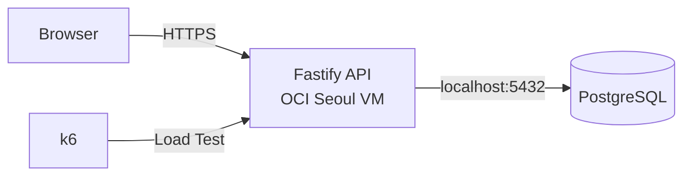

# HourBoard 프로젝트 기획서

## 1. 프로젝트 정의

- **프로젝트명:** HourBoard
- **사이트명:** 한시간동안 띄워드립니다
- **GitHub Repository:** `hourboard`
- **한 줄 설명:** 매 정각 가장 먼저 등록된 한 문구를 한 시간 동안 노출하고, 첫 등록 후 10초 안의 참가자에게 서버 처리 기준 순위를 반환하는 선착순 동시성 실험 서비스

HourBoard는 정각에 동시에 몰리는 요청을 하나의 시간 슬롯에 경쟁시키는 웹 서비스다. 가장 먼저 처리된 요청의 문구만 해당 시간의 전광판을 차지한다. 이후 요청은 전광판을 변경하지 못하며 자신이 몇 번째로 처리되었는지 즉시 확인한다.

사용자에게는 정각 티켓팅 연습 서비스로 보이고, 개발 관점에서는 동일 자원을 동시에 선점하는 요청의 정합성·순서·성능을 검증하는 프로젝트다.

---

## 2. 핵심 규칙

1. 한 라운드는 매시 정각에 시작하고 1시간 동안 유지한다.
2. 라운드 시작 전에 사용자는 문구를 미리 입력할 수 있다.
3. 등록 요청은 목표 시간 슬롯이 실제로 시작된 뒤에만 허용한다.
4. 해당 슬롯에서 PostgreSQL이 처음 확정한 요청 1건만 승자가 된다.
5. 승자의 문구는 다음 정각 전까지 전광판에 노출한다.
6. 첫 등록 전에는 등록을 허용하고, 첫 정상 등록부터 10초 미만 동안만 후속 등록을 허용한다.
7. 모든 성공 요청은 `1, 2, 3 ... N` 형태의 고유 순위를 받는다.
8. 순위 기준은 브라우저 클릭 시각이 아니라 서버와 PostgreSQL이 요청을 처리한 순서다.
9. 한 HTTP 등록 요청을 한 번의 도전으로 취급한다.
10. 초기 버전은 로그인, 사용자 계정, 과거 순위 복구를 제공하지 않는다.
11. 전광판 문구에는 HTML을 허용하지 않고 일반 문자열만 저장·출력한다.

### 사용자 문구

**1등**

> 축하합니다!
> 가장 먼저 등록하셨습니다.
> 작성하신 문구를 다음 정각까지 띄워드립니다.

**2등 이후**

> 아쉽군요!
> {position}번째로 등록하셨습니다!

---

## 3. 목표

### 제품 목표

- 정각 선착순 경쟁을 누구나 바로 이해할 수 있는 단순한 웹 서비스 제공
- 현재 전광판 문구와 남은 표시 시간을 명확하게 노출
- 등록 직후 사용자의 처리 순위를 즉시 반환
- 모바일 환경에서도 별도 설명 없이 사용할 수 있는 티켓팅 연습 UX 제공

### 기술 목표

- 동시에 들어온 요청에서 승자를 정확히 1명만 확정
- 모든 처리 성공 요청에 중복 없는 순번 부여
- hot path의 DB 접근을 등록 요청당 1회로 제한
- API 서버와 PostgreSQL을 동일 OCI VM에 배치해 외부 DB RTT 제거
- PostgreSQL row contention과 atomic UPSERT 동작 직접 검증
- 동시 요청 증가에 따른 p50 / p95 / p99 latency 변화 측정
- E2E 부하 테스트 결과를 반복 가능한 아티팩트로 저장

---

## 4. 범위 제외

초기 프로젝트 범위에 포함하지 않는다.

- 회원가입 및 로그인
- 소셜 로그인
- 사용자 프로필
- 과거 도전 기록 조회
- 사용자별 중복 등록 제한
- 관리자 페이지
- Redis
- 메시지 큐
- 다중 API 서버 인스턴스
- 별도 managed database
- WebSocket 기반 채팅
- 결제
- 광고
- 알림
- AI 기능

범위 추가는 기획 변경으로 취급하고 `.project/plan.md`를 먼저 수정한다.

---

## 5. 기술 스택

| 영역 | 선택 | 기준 |
| --- | --- | --- |
| Runtime | Node.js 24 LTS | 안정 LTS 사용 |
| Language | TypeScript | 서버·브라우저 공통 타입 관리 |
| Backend | Fastify 5.x | 낮은 오버헤드, JSON Schema 기반 검증 |
| Database | PostgreSQL 18.x | UPSERT, row locking, MVCC 기반 동시성 검증 |
| Infrastructure | OCI Compute Always Free | 단일 Linux VM |
| Region | OCI Seoul | OCI home region이 서울인 계정 기준 |
| Load Test | k6 | Registration Race, polling, Thundering Herd 및 latency 측정 |
| Process | systemd | API 프로세스 상시 실행 |

### 버전 정책

- prerelease 버전 사용 금지
- PostgreSQL 19 Beta 계열 사용 금지
- 구현 시작 시 안정 버전의 최신 patch/minor를 확인한 뒤 고정
- lock file 갱신은 사용자 승인 이후 수행

---

## 6. 인프라 구조

### 배치 원칙

- OCI Always Free Compute는 계정 home region에서 생성
- 서울 배포는 OCI home region이 Seoul인 계정 기준
- Phase 4 시작 시 OCI 공식 문서에서 현재 Always Free Compute 조건과 제공 shape를 다시 확인하고 무료 범위 안에서 단일 VM을 선택
- Always Free capacity 확보 실패 시 임의의 유료 shape로 변경 금지
- API와 PostgreSQL을 동일 VM에 배치
- PostgreSQL 5432 포트 외부 공개 금지
- PostgreSQL은 localhost 또는 private interface에서만 수신
- 외부 공개 포트는 웹 서비스에 필요한 포트만 허용
- DB connection pool은 애플리케이션 시작 시 생성하고 요청마다 재생성하지 않음
- 애플리케이션 상태를 메모리에만 저장하지 않음

---

## 7. 시간 모델

### 기준

- 저장 시간은 UTC 기반 `TIMESTAMPTZ`
- 사용자 표시는 Asia/Seoul 기준
- 라운드 경계는 매시 `00:00:00.000`
- API 서버의 시스템 시간을 authoritative clock으로 사용
- OCI VM의 시스템 시간 동기화 상태를 운영 점검 항목에 포함

### 목표 슬롯 검증

클라이언트는 등록 요청에 `slotAt`을 포함한다.

서버는 자신의 시스템 시간을 기준으로 요청의 `slotAt` 형식과 현재 Round 여부를 검증한다.

- `slotAt` 형식 오류 또는 정각이 아님: `400 INVALID_SLOT`
- 목표 Slot이 아직 시작 전: `425 ROUND_NOT_STARTED`
- 목표 Slot이 이미 종료: `409 ROUND_ENDED`
- 목표 Slot이 현재 활성 Slot: 첫 등록 또는 등록 Window 안의 요청만 처리

등록 가능한 시간 범위:
```text
slotAt <= serverTime < slotAt + 1 hour
```
이 Slot 검증은 DB 접근 전에 수행한다. 첫 등록 전에는 해당 Round의 등록을 허용한다. 첫 정상 등록 시각을 `firstRegisteredAt`으로 기록하고, `registrationClosesAt = min(firstRegisteredAt + 10 seconds, slotAt + 1 hour)`로 계산한다. `serverTime >= registrationClosesAt`이면 `409 REGISTRATION_CLOSED`를 반환한다. Window 판정과 순위 증가는 동일한 PostgreSQL UPSERT에서 원자적으로 처리한다.

---

## 8. 데이터 모델

### `hour_slots`
```sql
CREATE TABLE hour_slots (
    slot_start      TIMESTAMPTZ PRIMARY KEY,
    winner_message  TEXT NOT NULL,
    attempt_count   BIGINT NOT NULL DEFAULT 1 CHECK (attempt_count >= 1),
    created_at      TIMESTAMPTZ NOT NULL DEFAULT CURRENT_TIMESTAMP
);
```
초기 버전은 시간 슬롯 하나를 row 하나로 표현한다.

- `slot_start`: 시간 슬롯 고유 키
- `winner_message`: 최초 요청의 문구
- `attempt_count`: 해당 슬롯에서 처리된 요청 수이자 최신 순번
- `created_at`: 첫 정상 등록 시각 (`firstRegisteredAt`)

참가자 전체 기록을 별도 테이블에 저장하지 않는다. 등록 hot path를 단일 row write로 유지하기 위한 결정이다.

---

## 9. 핵심 동시성 처리

등록 요청은 SQL 1회로 승자 확정과 순번 증가를 처리한다.
```sql
WITH db_time AS MATERIALIZED (SELECT clock_timestamp() AS at)
INSERT INTO hour_slots (
    slot_start,
    winner_message,
    attempt_count,
    created_at
)
SELECT $1, $2, 1, db_time.at
FROM db_time
WHERE db_time.at >= $1::timestamptz
  AND db_time.at < $1::timestamptz + INTERVAL '1 hour'
ON CONFLICT (slot_start)
DO UPDATE
SET attempt_count = hour_slots.attempt_count + 1
WHERE clock_timestamp() < LEAST(hour_slots.created_at + INTERVAL '10 seconds', hour_slots.slot_start + INTERVAL '1 hour')
RETURNING
    slot_start,
    winner_message,
    attempt_count,
    created_at;
```
### 처리 의미

- 최초 INSERT 성공 요청: `attempt_count = 1`
- 이후 충돌 요청: 기존 row의 `attempt_count + 1`
- `winner_message`는 conflict update에서 수정하지 않음
- conflict update의 `WHERE`는 row lock 획득 뒤의 DB 시각으로 등록 마감 판정
- 마감 시각 이후에는 row update 없이 `409 REGISTRATION_CLOSED` 반환
- `attempt_count === 1`이면 승자
- 반환된 `attempt_count`가 사용자 순위

### 보장해야 할 불변식

동일 슬롯에서 N건의 요청이 모두 성공했을 때:
```text
winner count = 1
positions = 1..N
duplicate position = 0
missing position = 0
winner message mutation = 0
```
순위는 브라우저 클릭 timestamp 정렬값이 아니다. 같은 row를 갱신하는 PostgreSQL 처리 결과를 기준으로 한다.

---

## 10. API 계약

### `GET /api/round`

현재 전광판과 다음 라운드 시간을 조회한다.

응답 형태:
```json
{
  "serverTime": "2026-09-26T09:32:14.120Z",
  "currentSlot": {
    "startsAt": "2026-09-26T09:00:00.000Z",
    "endsAt": "2026-09-26T10:00:00.000Z",
    "message": "오늘은 칼퇴합니다",
    "attemptCount": 438,
    "registrationOpen": false,
    "registrationClosesAt": "2026-09-26T09:00:10.000Z"
  },
  "nextSlotAt": "2026-09-26T10:00:00.000Z"
}
```
현재 슬롯에 등록이 한 건도 없으면 `message`, `attemptCount`, `registrationClosesAt`은 `null`, `registrationOpen`은 `true`로 반환한다. 첫 등록 후에는 10초 Window와 Slot 종료 중 빠른 시각에 등록을 마감한다. 등록 마감 후에도 Winner 문구는 Slot 종료까지 표시한다.

### `POST /api/attempts`

현재 Round 등록.

클라이언트는 도전하려는 Round의 `slotAt`과 문구를 전달한다. 서버는 시스템 시간을 기준으로 `slotAt`이 현재 등록 가능한 Round인지 검증한다.

#### 요청
```json
{
  "slotAt": "2026-09-26T10:00:00.000Z",
  "message": "오늘도 살아남았다"
}
```
#### Winner 응답
```json
{
  "slotAt": "2026-09-26T11:00:00.000Z",
  "code": "WINNER",
  "message": "가장 먼저 등록하셨습니다. 작성하신 문구를 다음 정각까지 띄워드립니다.",
  "position": 1,
  "winner": true
}
```
#### 2등 이후 응답
```json
{
  "slotAt": "2026-09-26T11:00:00.000Z",
  "code": "RANKED",
  "message": "37번째로 등록하셨습니다.",
  "position": 37,
  "winner": false
}
```
등록 성공 응답은 slotAt, code, message, position, winner, registrationClosesAt 구조를 공통으로 사용한다.

Winner가 아닌 응답에는 다른 사용자의 winner_message를 포함하지 않는다. 현재 전광판 상태와 Winner 문구는 GET /api/round에서 조회한다.

### 오류 코드

| HTTP | Code | 의미 |
| --- | --- | --- |
| 400 | `INVALID_REQUEST` | 요청 본문 또는 입력 형식 오류 |
| 400 | `INVALID_SLOT` | `slotAt` 형식 오류 또는 정각이 아닌 Slot |
| 409 | `ROUND_ENDED` | 목표 Round 종료 |
| 409 | `REGISTRATION_CLOSED` | 첫 등록 후 10초 Window 종료 |
| 425 | `ROUND_NOT_STARTED` | 목표 Round 시작 전 |
| 500 | `INTERNAL_ERROR` | 서버 내부 처리 실패 |
| 503 | `DATABASE_UNAVAILABLE` | PostgreSQL 연결 불가 |

오류 응답은 `code`, `message`, `position`, `winner` 구조를 공통으로 사용한다.
```json
{
  "code": "ROUND_NOT_STARTED",
  "message": "아직 시작하지 않은 Round입니다.",
  "position": null,
  "winner": false
}
```
---

## 11. 성능 원칙

등록 요청의 critical path:
```text
request receive
→ input validation
→ slot validation
→ PostgreSQL UPSERT 1회
→ response serialize
→ response send
```
금지:
```text
SELECT 존재 확인
→ INSERT 또는 UPDATE
→ SELECT 순위 조회
```
필수 원칙:

- 등록 요청당 PostgreSQL query 1회
- DB connection pool 재사용
- winner 결정 전 외부 API 호출 금지
- winner 결정 전 로그 저장용 추가 DB write 금지
- hot row에 JSON 배열 누적 금지
- 등록 API에서 파일 I/O 금지
- 불필요한 ORM 추상화 도입 금지
- 성능 측정 전 임의의 cache/Redis 추가 금지

절대 latency 목표는 기획 단계에서 임의로 확정하지 않는다. Phase 3에서는 로컬 환경 baseline을 만들고, Phase 4에서는 OCI 외부 환경 baseline과 RTT를 별도로 측정한다. 두 환경의 결과를 구분한 뒤 성능 budget 필요 여부를 판단한다.

측정 항목:

- server processing time
- end-to-end latency
- p50
- p95
- p99
- requests/sec
- DB lock wait
- 오류율
- 중복 순위 건수
- 누락 순위 건수

---

## 12. 보안 및 입력 정책

- 문구는 일반 문자열만 허용
- HTML 저장·렌더링 금지
- 브라우저 출력은 `textContent` 또는 동등한 escaping 방식 사용
- request body 최대 크기 제한
- 문구 길이 제한 적용
- 빈 문자열 및 공백-only 문자열 거부
- DB credential은 환경 변수로 관리
- `.env` 커밋 금지
- PostgreSQL 외부 공개 금지
- production stack trace 클라이언트 노출 금지

---

## 13. Repository 구조
```text
hourboard/
├─ .project/
│  └─ plan.md
├─ db/
│  └─ migrations/
├─ docs/
│  ├─ instructions/
│  └─ results/
├─ src/
│  ├─ config/
│  ├─ db/
│  ├─ routes/
│  ├─ schemas/
│  ├─ services/
│  └─ shared/
├─ public/
│  ├─ scripts/
│  └─ styles/
├─ tests/
│  └─ e2e/
│     └─ artifacts/
├─ k6/
│  ├─ scenarios/
│  └─ results/
├─ .gitignore
├─ AGENTS.md
├─ DESIGN.md
└─ README.md
```
### 디렉토리 책임

| 경로 | 책임 |
| --- | --- |
| `src/config/` | 환경 변수 및 런타임 설정 |
| `src/db/` | PostgreSQL pool 및 query 실행 경계 |
| `src/routes/` | Fastify route 등록 |
| `src/schemas/` | request/response JSON Schema |
| `src/services/` | 슬롯·등록 도메인 로직 |
| `src/shared/` | 여러 모듈이 공유하는 최소 공통 코드 |
| `db/migrations/` | PostgreSQL schema 변경 |
| `public/` | 브라우저 정적 자산 |
| `tests/e2e/` | 사용자 흐름 및 동시성 E2E 검증 |
| `tests/e2e/artifacts/` | 반복 가능한 E2E 결과 아티팩트 |
| `k6/scenarios/` | 부하 테스트 시나리오 |
| `k6/results/` | k6 원본·요약 결과 |
| `docs/instructions/` | 현재 Phase 구현 지침 |
| `docs/results/` | 완료된 Phase 구현·검증 결과 |

구현 전 단계에서는 디렉토리만 유지하고 미완성 소스 파일을 선행 생성하지 않는다.

---

## 현재 구현 기준

Phase 1과 Phase 2 MVP 구현 및 이후 확인된 수정 사항은 적용 완료된 상태를 기준으로 한다.

이 문서에서 앞으로 구현 대상으로 관리하는 범위는 **Phase 3과 Phase 4**다.

Phase 1·2의 실제 구현 사실과 검증 이력은 `docs/results/*`를 우선하며, Phase 3·4에서 기존 동작을 임의로 되돌리거나 재설계하지 않는다.

---

## 14. Phase 계획

### Phase 1 — Concurrency Core

**상태: 완료**

기존 구현과 검증 결과는 `docs/results/phase1-concurrency-core.md`를 기준으로 한다.

Phase 3 작업에서 Phase 1 동시성 semantics를 임의로 변경하지 않는다.

### Phase 2 — Ticketing UI

**상태: 완료**

현재 MVP에는 아래 동작이 반영된 상태를 기준으로 한다.

- 전광판 및 빈 Slot UI
- server time 기반 countdown
- 문구 사전 입력
- 등록 버튼 상태 처리
- 첫 등록 후 10초 Registration Window
- `REGISTRATION_CLOSED`
- 등록 마감 후 버튼 숨김 및 다음 Round 준비
- Winner / Ranked 결과 UI
- 오류 및 결과 미확정 UI
- 모바일 및 접근성 처리
- 실제 로컬 실행 경로 검증

기존 구현과 검증 결과는 `docs/results/phase2-ticketing-ui.md` 및 이후 MVP 수정 이력을 기준으로 한다.

Phase 3에서 위 기능을 다시 설계하지 않는다.

### Phase 3 — Load, Race & Open-State Verification

**상태: 다음 작업**

목적은 현재 MVP의 동시성 정합성을 유지하면서 등록 race, 정각 open-state 전달 방식, polling/cache 효과, Thundering Herd를 실제 측정하는 것이다.

세부 구현 기준은 `docs/instructions/phase3-load-race-verification.md`를 따른다.

#### 3A. Registration Race

범위:

- Phase 3 전용 PostgreSQL load-test database
- k6 및 Node.js 기반 race 검증
- concurrency 10 / 50 / 100 / 200
- 첫 등록 후 10초 Registration Window 유지
- `requested / accepted / registrationClosed / unexpectedFailed` 분리
- p50 / p95 / p99
- RPS
- acceptance rate
- 예상하지 못한 오류율
- PostgreSQL `pg_stat_activity`, `pg_locks` 기반 contention 관찰
- Winner / Position 정합성 자동 검증
- 반복 가능한 결과 아티팩트

accepted 요청 수를 `S`라고 할 때:
```text
S >= 1
winner count among accepted = 1
positions among accepted = 1..S
duplicate position = 0
missing position = 0
winner message mutation = 0
```
`REGISTRATION_CLOSED` 요청은 Position을 소비하지 않아야 한다.

#### 3B. Open-State Delivery

정각과 Registration Window 상태를 브라우저에 전달하는 세 방식을 비교한다.
```text
Mode A — Client Timer
Mode B — Direct Polling
Mode C — Cached Polling
```
범위:

- `GET /api/open-state`
- Client Timer baseline
- Direct Polling
- Phase 3 전용 local shared-cache proxy
- Cached Polling
- polling client 100 / 500 / 1000
- client request count
- origin request count
- cache hit / miss
- cache suppression ratio
- p50 / p95 / p99
- open-state detection delay

`GET /api/open-state`는 UI 상태 전달용이다. 최종 등록 허용 여부는 항상 `POST /api/attempts`와 PostgreSQL이 판정한다.

Cached Polling 실험은 실제 CDN이 아니라 **local shared-cache simulation**으로 기록한다.

Redis는 도입하지 않는다.

#### 3C. Thundering Herd

범위:

- concurrency 10 / 50 / 100 / 200
- 공통 barrier를 이용한 순간 POST 집중
- dispatch spread
- p50 / p95 / p99
- RPS
- accepted / registrationClosed / unexpectedFailed
- connection pool 대기 징후
- PostgreSQL lock contention
- Winner / Position 정합성

실제 매시 정각을 기다리는 방식만 사용하지 않고 반복 가능한 synthetic barrier를 기준 baseline으로 사용한다.

#### Phase 3 완료 기준

- 기존 MVP build / E2E 재통과
- 10초 Registration Window 정합성 유지
- Registration Race 10 / 50 / 100 / 200 결과 존재
- 각 race 단계 accepted Winner 1명
- accepted Position `1..S`
- 중복 Position 0
- 누락 Position 0
- Winner 문구 mutation 0
- `REGISTRATION_CLOSED`가 Position을 소비하지 않음
- Client Timer baseline 존재
- Direct Polling 100 / 500 / 1000 결과 존재
- Cached Polling 100 / 500 / 1000 결과 존재
- client request / origin request 분리 측정
- cache hit / miss 및 suppression ratio 기록
- open-state detection delay 기록
- Thundering Herd 10 / 50 / 100 / 200 결과 존재
- dispatch spread 기록
- PostgreSQL contention snapshot 존재
- 측정값으로 확인된 병목과 확인하지 못한 원인을 구분
- `k6/results/phase3/`에 반복 가능한 아티팩트 생성
- `docs/results/phase3-load-race-verification.md` 작성
- README에 실제 Phase 3 상태 반영

Phase 3은 baseline 생성 단계다. 임의 p95/RPS 목표를 pass/fail 기준으로 만들지 않는다.

### Phase 4 — OCI Deployment

**상태: 예정**

Phase 3 로컬 baseline을 확보한 뒤 실제 외부 환경에서 배포·복구·보안·latency를 검증한다.

세부 구현 기준은 `docs/instructions/phase4-oci-deployment.md`를 따른다.

범위:

- OCI account home region 확인
- Phase 4 시작 시 OCI 공식 문서에서 현재 Always Free 조건 재확인
- home region이 Seoul이고 실제 무료 Compute 생성이 가능한 경우에만 Seoul VM 생성
- 무료 조건이 불명확하거나 capacity가 없으면 임의 유료 resource로 전환하지 않음
- Node.js 24 LTS 설치
- PostgreSQL 18.x 설치
- application deployment
- systemd service
- PostgreSQL `localhost:5432` 제한
- 운영 환경 변수
- HTTPS
- reboot recovery
- 실제 외부 환경 E2E
- 핵심 Registration Race 재검증
- 외부 RTT 및 등록 latency 측정
- Phase 3 로컬 baseline과 Phase 4 OCI 결과를 환경별로 분리 기록

완료 기준:

- HTTPS로 서비스 접근 가능
- PostgreSQL 5432 외부 접근 불가
- application 내부 포트 불필요한 외부 공개 없음
- VM reboot 후 PostgreSQL과 HourBoard 자동 복구
- reboot 후 HTTPS 접근 재확인
- 배포 환경에서 Winner / Position / 10초 Registration Window 핵심 invariant 통과
- 외부 RTT 기록
- 등록 p50 / p95 / p99 기록
- 로컬 Phase 3 결과와 OCI 결과를 같은 환경의 수치처럼 혼합하지 않음
- 실제 배포 환경 결과 문서 작성

---

## 15. 현재 단계에서 구현하지 않는 확장안

Phase 3·4에서 아래 기능을 선반영하지 않는다.

- Redis atomic counter
- Redis 기반 open-state cache
- Redis Sorted Set waiting room
- Kafka
- Message Queue
- Virtual Waiting Room
- 여러 API 인스턴스
- 별도 ranking service
- historical attempts table
- 회원별 최고 기록
- 리더보드
- WebSocket / SSE
- 실제 CDN / Edge 배포
- CDN 기반 정적 자산 분리
- 별도 managed database
- 자동 성능 회귀 차단
- 임의 SLO

Phase 3의 Cached Polling은 실제 CDN 구축이 아니라 **local shared-cache simulation**이다.

Redis, Queue, Waiting Room은 PostgreSQL race 앞단에서 요청 순서를 바꿀 수 있으므로 Phase 3에 도입하지 않는다.

Phase 3 측정 결과에서 필요성이 확인되어도 즉시 구현하지 않는다. 별도 기획 변경 후 후속 Phase로 추가한다.

---

## 16. GitHub Repository 정보

### Repository
```text
hourboard
```
### Description
```text
매 정각 가장 먼저 등록된 한 문구를 한 시간 동안 노출하고, 첫 등록 후 10초 안의 참가자에게 서버 처리 기준 순위를 반환하는 선착순 동시성 실험 서비스
```
### Topics
```text
nodejs
typescript
fastify
postgresql
concurrency
race-condition
load-testing
k6
oci
```
---

## 17. 기술 기준 출처

- Node.js Downloads: https://nodejs.org/en/download/current
- Fastify Documentation: https://fastify.dev/docs/latest/
- PostgreSQL Versioning Policy: https://www.postgresql.org/support/versioning/
- OCI Free Tier: https://docs.oracle.com/en-us/iaas/Content/FreeTier/freetier.htm
