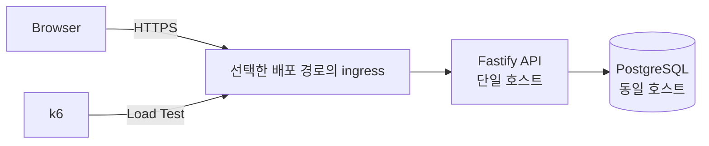

# HourBoard 프로젝트 기획서

## 1. 프로젝트 정의

- **프로젝트명:** HourBoard
- **사이트명:** 한시간동안 띄워드립니다
- **GitHub Repository:** `hourboard`
- **한 줄 설명:** 매 정각 가장 먼저 등록된 한 문구를 한 시간 동안 노출하고, 첫 등록 후 10초 안의 참가자에게 서버 처리 기준 순위를 반환하는 선착순 동시성 실험 서비스

HourBoard는 정각에 동시에 몰리는 요청을 하나의 시간 슬롯에 경쟁시키는 웹 서비스다. 가장 먼저 처리된 요청의 문구만 해당 시간의 전광판을 차지한다. 이후 요청은 전광판을 변경하지 못하며 자신이 몇 번째로 처리되었는지 즉시 확인한다.

사용자에게는 정각 티켓팅 연습 서비스로 보이고, 개발 관점에서는 동일 자원을 동시에 선점하는 요청의 정합성·순서·성능을 검증하는 프로젝트다.

---

## 2. 핵심 규칙

1. 한 라운드는 매시 정각에 시작하고 1시간 동안 유지한다.
2. 라운드 시작 전에 사용자는 문구를 미리 입력할 수 있다.
3. 등록 요청은 목표 시간 슬롯이 실제로 시작된 뒤에만 허용한다.
4. 해당 슬롯에서 PostgreSQL이 처음 확정한 요청 1건만 승자가 된다.
5. 승자의 문구는 다음 정각 전까지 전광판에 노출한다.
6. 첫 등록 전에는 등록을 허용하고, 첫 정상 등록부터 10초 미만 동안만 서버가 후속 등록을 허용한다.
7. `WINNER` 또는 `RANKED` 응답을 받은 현재 페이지 세션은 해당 Round에서 등록 버튼을 즉시 숨기고 추가 UI 제출을 막는다. 이 UI 상태는 다른 사용자의 10초 Registration Window를 닫지 않는다.
8. 정상 등록 응답을 받은 현재 페이지에는 10초 마감 countdown을 표시하지 않고 결과 카드를 유지한다. 참여 완료 상태는 브라우저 영속 저장소에 저장하지 않아 새로고침 후 복원되지 않으며, 서버에 사용자 식별 기능이 없어 버튼이 다시 나타날 수 있다. 현재 페이지에서 다음 Round를 감지하면 참여 완료 상태를 초기화한다.
9. 모든 성공 요청은 `1, 2, 3 ... N` 형태의 고유 순위를 받는다.
10. 순위 기준은 브라우저 클릭 시각이 아니라 서버와 PostgreSQL이 요청을 처리한 순서다.
11. 한 HTTP 등록 요청을 한 번의 도전으로 취급한다.
12. 초기 버전은 로그인, 사용자 계정, 과거 순위 복구를 제공하지 않는다.
13. 전광판 문구에는 HTML을 허용하지 않고 일반 문자열만 저장·출력한다.

### 사용자 문구

**1등**

> 축하합니다!
> 가장 먼저 등록하셨습니다.
> 작성하신 문구를 다음 정각까지 띄워드립니다.

**2등 이후**

> 아쉽군요!
> {position}번째로 등록하셨습니다!

---

## 3. 목표

### 제품 목표

- 정각 선착순 경쟁을 누구나 바로 이해할 수 있는 단순한 웹 서비스 제공
- 현재 전광판 문구와 남은 표시 시간을 명확하게 노출
- 등록 직후 사용자의 처리 순위를 즉시 반환
- 모바일 환경에서도 별도 설명 없이 사용할 수 있는 티켓팅 연습 UX 제공

### 기술 목표

- 동시에 들어온 요청에서 승자를 정확히 1명만 확정
- 모든 처리 성공 요청에 중복 없는 순번 부여
- hot path의 DB 접근을 등록 요청당 1회로 제한
- API 서버와 PostgreSQL을 동일 서버에 배치해 외부 DB RTT 제거
- PostgreSQL row contention과 atomic UPSERT 동작 직접 검증
- 동시 요청 증가에 따른 p50 / p95 / p99 latency 변화 측정
- E2E 부하 테스트 결과를 반복 가능한 아티팩트로 저장

---

## 4. 범위 제외

초기 프로젝트 범위에 포함하지 않는다.

- 회원가입 및 로그인
- 소셜 로그인
- 사용자 프로필
- 과거 도전 기록 조회
- 사용자별 중복 등록 제한
- 관리자 페이지
- Redis
- 메시지 큐
- 다중 API 서버 인스턴스
- 별도 managed database
- WebSocket 기반 채팅
- 결제
- 광고
- 알림
- AI 기능

범위 추가는 기획 변경으로 취급하고 `.project/plan.md`를 먼저 수정한다.

---

## 5. 기술 스택

| 영역 | 선택 | 기준 |
| --- | --- | --- |
| Runtime | Node.js 24 LTS | 안정 LTS 사용 |
| Language | TypeScript | 서버·브라우저 공통 타입 관리 |
| Backend | Fastify 5.x | 낮은 오버헤드, JSON Schema 기반 검증 |
| Database | PostgreSQL 18.x | UPSERT, row locking, MVCC 기반 동시성 검증 |
| Infrastructure | 단일 호스트 | OCI Linux VM 또는 Windows 11 미니PC + Docker Desktop |
| 배포 위치 | OCI Japan East (Tokyo) 또는 자체 호스팅 | 실제 배포 환경을 결과에 명시 |
| Load Test | k6 | Registration Race, polling, Thundering Herd 및 latency 측정 |
| Process | OCI: systemd / 미니PC: Docker Desktop | 선택한 경로의 재시작·reboot 복구 검증 |

### 버전 정책

- prerelease 버전 사용 금지
- PostgreSQL 19 Beta 계열 사용 금지
- 구현 시작 시 안정 버전의 최신 patch/minor를 확인한 뒤 고정
- lock file 갱신은 사용자 승인 이후 수행

---

## 6. 인프라 구조

### 배치 원칙

- OCI Always Free Compute는 계정 home region에서 생성
- OCI 시도는 현재 계정 home region인 Japan East (Tokyo) 기준
- OCI를 재시도할 때 공식 문서와 Console에서 무료 조건을 확인하고 유료 shape로 임의 변경하지 않음
- Tokyo A1 capacity 부족에 따라 Phase 4B 기본 경로는 자체 호스팅 미니PC + DuckDNS + Traefik으로 선택
- Phase 4B 운영 주소는 `hourboard.duckdns.org`; 공유기 WAN에 직접 도달 가능한 공인 IPv4가 있는지 확인한 뒤 TCP 443만 미니PC로 포트포워딩
- DuckDNS updater로 변경되는 공인 IPv4를 갱신하고 Traefik의 Let's Encrypt DNS-01으로 HTTPS 인증서를 발급·갱신; DNS-01을 위해 TCP 80을 공개하지 않음
- Phase 4B의 Traefik과 Fastify는 `edge` Docker network를, Fastify와 PostgreSQL은 `data` Docker network를 공유함. PostgreSQL은 `edge`에 연결하지 않고 앱·DB 포트를 호스트에 publish하지 않음
- API와 PostgreSQL을 동일 호스트에 배치
- PostgreSQL 5432 포트 외부 공개 금지
- PostgreSQL은 localhost 또는 컨테이너 내부 네트워크에서만 접근 허용
- OCI 경로에서만 웹 서비스에 필요한 호스트 포트를 공개
- DB connection pool은 애플리케이션 시작 시 생성하고 요청마다 재생성하지 않음
- 애플리케이션 상태를 메모리에만 저장하지 않음

---

## 7. 시간 모델

### 기준

- 저장 시간은 UTC 기반 `TIMESTAMPTZ`
- 사용자 표시는 Asia/Seoul 기준
- 라운드 경계는 매시 `00:00:00.000`
- API 서버의 시스템 시간을 authoritative clock으로 사용
- 배포 서버의 시스템 시간 동기화 상태를 운영 점검 항목에 포함

### 목표 슬롯 검증

클라이언트는 등록 요청에 `slotAt`을 포함한다.

서버는 자신의 시스템 시간을 기준으로 요청의 `slotAt` 형식과 현재 Round 여부를 검증한다.

- `slotAt` 형식 오류 또는 정각이 아님: `400 INVALID_SLOT`
- 목표 Slot이 아직 시작 전: `425 ROUND_NOT_STARTED`
- 목표 Slot이 이미 종료: `409 ROUND_ENDED`
- 목표 Slot이 현재 활성 Slot: 첫 등록 또는 등록 Window 안의 요청만 처리

등록 가능한 시간 범위:
```text
slotAt <= serverTime < slotAt + 1 hour
```
이 Slot 검증은 DB 접근 전에 수행한다. 첫 등록 전에는 해당 Round의 등록을 허용한다. 첫 정상 등록 시각을 `firstRegisteredAt`으로 기록하고, `registrationClosesAt = min(firstRegisteredAt + 10 seconds, slotAt + 1 hour)`로 계산한다. `serverTime >= registrationClosesAt`이면 `409 REGISTRATION_CLOSED`를 반환한다. Window 판정과 순위 증가는 동일한 PostgreSQL UPSERT에서 원자적으로 처리한다.

---

## 8. 데이터 모델

### `hour_slots`
```sql
CREATE TABLE hour_slots (
    slot_start      TIMESTAMPTZ PRIMARY KEY,
    winner_message  TEXT NOT NULL,
    attempt_count   BIGINT NOT NULL DEFAULT 1 CHECK (attempt_count >= 1),
    created_at      TIMESTAMPTZ NOT NULL DEFAULT CURRENT_TIMESTAMP
);
```
초기 버전은 시간 슬롯 하나를 row 하나로 표현한다.

- `slot_start`: 시간 슬롯 고유 키
- `winner_message`: 최초 요청의 문구
- `attempt_count`: 해당 슬롯에서 처리된 요청 수이자 최신 순번
- `created_at`: 첫 정상 등록 시각 (`firstRegisteredAt`)

참가자 전체 기록을 별도 테이블에 저장하지 않는다. 등록 hot path를 단일 row write로 유지하기 위한 결정이다.

---

## 9. 핵심 동시성 처리

등록 요청은 SQL 1회로 승자 확정과 순번 증가를 처리한다.
```sql
WITH db_time AS MATERIALIZED (SELECT clock_timestamp() AS at)
INSERT INTO hour_slots (
    slot_start,
    winner_message,
    attempt_count,
    created_at
)
SELECT $1, $2, 1, db_time.at
FROM db_time
WHERE db_time.at >= $1::timestamptz
  AND db_time.at < $1::timestamptz + INTERVAL '1 hour'
ON CONFLICT (slot_start)
DO UPDATE
SET attempt_count = hour_slots.attempt_count + 1
WHERE clock_timestamp() < LEAST(hour_slots.created_at + INTERVAL '10 seconds', hour_slots.slot_start + INTERVAL '1 hour')
RETURNING
    slot_start,
    winner_message,
    attempt_count,
    created_at;
```
### 처리 의미

- 최초 INSERT 성공 요청: `attempt_count = 1`
- 이후 충돌 요청: 기존 row의 `attempt_count + 1`
- `winner_message`는 conflict update에서 수정하지 않음
- conflict update의 `WHERE`는 row lock 획득 뒤의 DB 시각으로 등록 마감 판정
- 마감 시각 이후에는 row update 없이 `409 REGISTRATION_CLOSED` 반환
- `attempt_count === 1`이면 승자
- 반환된 `attempt_count`가 사용자 순위

### 보장해야 할 불변식

동일 슬롯에서 N건의 요청이 모두 성공했을 때:
```text
winner count = 1
positions = 1..N
duplicate position = 0
missing position = 0
winner message mutation = 0
```
순위는 브라우저 클릭 timestamp 정렬값이 아니다. 같은 row를 갱신하는 PostgreSQL 처리 결과를 기준으로 한다.

---

## 10. API 계약

### `GET /api/round`

현재 전광판과 다음 라운드 시간을 조회한다.

응답 형태:
```json
{
  "serverTime": "2026-09-26T09:32:14.120Z",
  "currentSlot": {
    "startsAt": "2026-09-26T09:00:00.000Z",
    "endsAt": "2026-09-26T10:00:00.000Z",
    "message": "오늘은 칼퇴합니다",
    "attemptCount": 438,
    "registrationOpen": false,
    "registrationClosesAt": "2026-09-26T09:00:10.000Z"
  },
  "nextSlotAt": "2026-09-26T10:00:00.000Z"
}
```
현재 슬롯에 등록이 한 건도 없으면 `message`, `attemptCount`, `registrationClosesAt`은 `null`, `registrationOpen`은 `true`로 반환한다. 첫 등록 후에는 10초 Window와 Slot 종료 중 빠른 시각에 등록을 마감한다. 등록 마감 후에도 Winner 문구는 Slot 종료까지 표시한다.

### `POST /api/attempts`

현재 Round 등록.

클라이언트는 도전하려는 Round의 `slotAt`과 문구를 전달한다. 서버는 시스템 시간을 기준으로 `slotAt`이 현재 등록 가능한 Round인지 검증한다.

#### 요청
```json
{
  "slotAt": "2026-09-26T10:00:00.000Z",
  "message": "오늘도 살아남았다"
}
```
#### Winner 응답
```json
{
  "slotAt": "2026-09-26T10:00:00.000Z",
  "code": "WINNER",
  "message": "가장 먼저 등록하셨습니다. 작성하신 문구를 다음 정각까지 띄워드립니다.",
  "position": 1,
  "winner": true,
  "registrationClosesAt": "2026-09-26T10:00:10.000Z"
}
```
#### 2등 이후 응답
```json
{
  "slotAt": "2026-09-26T10:00:00.000Z",
  "code": "RANKED",
  "message": "37번째로 등록하셨습니다.",
  "position": 37,
  "winner": false,
  "registrationClosesAt": "2026-09-26T10:00:10.000Z"
}
```
등록 성공 응답은 slotAt, code, message, position, winner, registrationClosesAt 구조를 공통으로 사용한다.

Winner가 아닌 응답에는 다른 사용자의 winner_message를 포함하지 않는다. 현재 전광판 상태와 Winner 문구는 GET /api/round에서 조회한다.

### 오류 코드

| HTTP | Code | 의미 |
| --- | --- | --- |
| 400 | `INVALID_REQUEST` | 요청 본문 또는 입력 형식 오류 |
| 400 | `INVALID_SLOT` | `slotAt` 형식 오류 또는 정각이 아닌 Slot |
| 409 | `ROUND_ENDED` | 목표 Round 종료 |
| 409 | `REGISTRATION_CLOSED` | 첫 등록 후 10초 Window 종료 |
| 425 | `ROUND_NOT_STARTED` | 목표 Round 시작 전 |
| 500 | `INTERNAL_ERROR` | 서버 내부 처리 실패 |
| 503 | `DATABASE_UNAVAILABLE` | PostgreSQL 연결 불가 |

오류 응답은 `code`, `message`, `position`, `winner` 구조를 공통으로 사용한다.
```json
{
  "code": "ROUND_NOT_STARTED",
  "message": "아직 시작하지 않은 Round입니다.",
  "position": null,
  "winner": false
}
```
---

## 11. 성능 원칙

등록 요청의 critical path:
```text
request receive
→ input validation
→ slot validation
→ PostgreSQL UPSERT 1회
→ response serialize
→ response send
```
금지:
```text
SELECT 존재 확인
→ INSERT 또는 UPDATE
→ SELECT 순위 조회
```
필수 원칙:

- 등록 요청당 PostgreSQL query 1회
- DB connection pool 재사용
- winner 결정 전 외부 API 호출 금지
- winner 결정 전 로그 저장용 추가 DB write 금지
- hot row에 JSON 배열 누적 금지
- 등록 API에서 파일 I/O 금지
- 불필요한 ORM 추상화 도입 금지
- 성능 측정 전 임의의 cache/Redis 추가 금지

절대 latency 목표는 기획 단계에서 임의로 확정하지 않는다. Phase 3에서는 로컬 환경 baseline을 만들고, Phase 4에서는 실제 외부 배포 환경의 baseline과 RTT를 별도로 측정한다. 두 환경의 결과를 구분한 뒤 성능 budget 필요 여부를 판단한다.

측정 항목:

- server processing time
- end-to-end latency
- p50
- p95
- p99
- requests/sec
- DB lock wait
- 오류율
- 중복 순위 건수
- 누락 순위 건수

---

## 12. 보안 및 입력 정책

- 문구는 일반 문자열만 허용
- HTML 저장·렌더링 금지
- 브라우저 출력은 `textContent` 또는 동등한 escaping 방식 사용
- request body 최대 크기 제한
- Fastify request body 한도는 4 KiB로 유지
- 문구 길이 제한 적용
- 빈 문자열 및 공백-only 문자열 거부
- DB credential과 DuckDNS token은 운영 환경 변수로 관리
- `.env`, `deploy/production.env` 실제 값 commit 금지
- PostgreSQL host port 공개 금지
- Fastify host port 공개 금지
- Production ingress는 Traefik TCP 443만 공개
- Production stack trace 클라이언트 노출 금지
- HTML·정적 자산·API 응답에 CSP, `X-Content-Type-Options: nosniff`, `Referrer-Policy: no-referrer` 적용
- 프런트엔드 정적 파일에서 운영 secret 관련 문자열이 없어야 함
- Production Traefik에서 `POST /api/attempts`에만 rate limit middleware 적용
- Rate limit의 Production 실제 동작은 HTTP 429 및 GET 경로 200으로 확인
- Traefik dashboard public 노출 금지
- 현재 Traefik은 Docker service discovery를 위해 `/var/run/docker.sock`을 read-only bind mount로 직접 사용함
- Docker socket의 `:ro`는 Docker API 자체를 read-only로 제한하는 보안 경계로 취급하지 않음
- Docker socket proxy 또는 다른 provider 방식으로의 보강은 별도 인프라 변경으로 검토하며, 검증 없이 즉시 Production에 적용하지 않음
- Fastify container는 `node` 사용자 실행 상태를 유지
- 공유기 DMZ 사용 금지
- 80 / 3000 / 5432 포트포워딩 금지

### Beta Web 품질 점검

작업 PC 구현 기준:

- 모바일 제목 줄바꿈·overflow 보정
- 입력 오류 안내
- HTTP `429` 사용자 안내
- 페이지 title / Open Graph metadata
- `og-image.png`
- `robots.txt`
- `sitemap.xml`
- `/api` 미정의 경로 JSON 404
- 전광판·버튼·disabled 상태 색상 대비 4.79:1 이상 확인

작업 PC 검증 완료:

- `npm run build`
- Production Compose 설정 검사
- 로컬 정적 파일·404 HTTP 확인
- 프런트엔드 secret 관련 문자열 미검출

Production 확인 완료:

- 동일 LAN에서 공개 HTTPS 주소를 통한 실제 Chrome 브라우저 E2E
- 등록 API rate limit의 HTTP 429 및 GET 경로 200
- 동일 LAN에서 공개 HTTPS 주소를 통한 페이지 로드 속도 측정
- Beta UI/Web 품질 변경의 실제 배포

외부망 Registration Race E2E와 지연 시간 측정까지 완료했다. 수치와 실행 환경은 `docs/results/phase4-production-deployment.md`에 기록한다.

---

## 13. Repository 구조
```text
hourboard/
├─ .project/
│  └─ plan.md
├─ db/
│  └─ migrations/
├─ deploy/
│  └─ production.env.example
├─ docs/
│  ├─ image/
│  ├─ instructions/
│  ├─ progress/
│  └─ results/
├─ src/
│  ├─ config/
│  ├─ db/
│  ├─ routes/
│  ├─ schemas/
│  ├─ services/
│  └─ shared/
├─ public/
│  ├─ scripts/
│  ├─ styles/
│  ├─ og-image.png
│  ├─ robots.txt
│  └─ sitemap.xml
├─ tests/
│  └─ e2e/
│     └─ artifacts/
├─ k6/
│  ├─ scenarios/
│  └─ results/
├─ .env.example
├─ compose.yaml
├─ compose.prod.yaml
├─ Dockerfile.prod
├─ .gitignore
├─ AGENTS.md
├─ DESIGN.md
└─ README.md
```
### 디렉토리 책임

| 경로 | 책임 |
| --- | --- |
| `src/config/` | 환경 변수 및 런타임 설정 |
| `src/db/` | PostgreSQL pool 및 query 실행 경계 |
| `src/routes/` | Fastify route 등록 |
| `src/schemas/` | request/response JSON Schema |
| `src/services/` | 슬롯·등록 도메인 로직 |
| `src/shared/` | 여러 모듈이 공유하는 최소 공통 코드 |
| `db/migrations/` | PostgreSQL schema 변경 |
| `public/` | 브라우저 정적 자산 |
| `tests/e2e/` | 사용자 흐름 및 동시성 E2E 검증 |
| `tests/e2e/artifacts/` | 반복 가능한 E2E 결과 아티팩트 |
| `k6/scenarios/` | 부하 테스트 시나리오 |
| `k6/results/` | k6 원본·요약 결과 |
| `deploy/` | Production 환경 변수 key template 및 배포 보조 파일 |
| `docs/instructions/` | 현재 Phase 구현 지침 |
| `docs/progress/` | 진행 중인 배포·인프라 검증 사실 기록 |
| `docs/results/` | 완료된 Phase 구현·검증 결과 |

구현 전 단계에서는 디렉토리만 유지하고 미완성 소스 파일을 선행 생성하지 않는다.

---

## 현재 구현 기준

Phase 1과 Phase 2 MVP 구현 및 이후 확인된 수정 사항을 기준으로 한다. 최근 Beta UI/Web 품질 변경과 등록 성공 후 버튼 처리 변경은 Production에 배포하고 검증했다.

이 문서에서 완료된 최종 검증 범위는 **Phase 4**다.

Phase 1·2·3의 실제 구현 사실과 검증 이력은 `docs/results/*`를 우선하며, Phase 4에서 기존 동작을 임의로 되돌리거나 재설계하지 않는다.

---

## 14. Phase 계획

### Phase 1 — Concurrency Core

**상태: 완료**

기존 구현과 검증 결과는 `docs/results/phase1-concurrency-core.md`를 기준으로 한다.

Phase 3 작업에서 Phase 1 동시성 semantics를 임의로 변경하지 않는다.

### Phase 2 — Ticketing UI

**상태: 완료**

현재 MVP에는 아래 동작이 반영된 상태를 기준으로 한다.

- 전광판 및 빈 Slot UI
- server time 기반 countdown
- 문구 사전 입력
- 등록 버튼 상태 처리
- 서버의 첫 등록 후 10초 Registration Window
- `REGISTRATION_CLOSED`
- Winner / Ranked 결과 UI
- `WINNER` 또는 `RANKED` 성공 응답을 받은 현재 페이지 세션에서 등록 버튼 즉시 숨김·비활성화
- 정상 등록 응답을 받은 현재 페이지에 Registration Window countdown 미표시
- 정상 등록 응답 뒤 제출한 입력 문구 비움·새 초안 입력 허용
- 등록 성공 결과 카드 유지
- 다른 브라우저의 10초 Registration Window는 서버 규칙대로 유지
- 새로고침 시 참여 완료 상태 미복원·서버 사용자 식별 없음
- 현재 페이지에서 다음 Round 감지 시 참여 완료 상태 초기화
- 오류 및 결과 미확정 UI
- 모바일 및 접근성 처리
- 실제 로컬 실행 경로 검증

최근 UI 후속 변경은 build, 실제 PostgreSQL·Chrome 브라우저 E2E, Production Chrome 브라우저 E2E를 통과했다. 열린 페이지의 다음 Round 전환도 실제 운영 시각 경과로 확인했다.

기존 구현과 검증 결과는 `docs/results/phase2-ticketing-ui.md` 및 이후 MVP 수정 이력을 기준으로 한다.

### Phase 3 — Load, Race & Open-State Verification

**상태: 완료**

- Registration Race 10 / 50 / 100 / 200 검증 완료
- 10초 Registration Window 정합성 검증 완료
- Client Timer / Direct Polling / Cached Polling 비교 완료
- local shared-cache simulation 완료
- Thundering Herd 검증 완료
- PostgreSQL contention 측정 완료
- baseline artifact 생성 완료
- 결과: `docs/results/phase3-load-race-verification.md`

### Phase 4 — Production Deployment

**상태: 완료**

Phase 3 로컬 baseline을 수정하지 않고 비교 기준으로 사용한다. 실제 외부 환경에서 배포·복구·보안·latency를 검증한다.

**Phase 4A — OCI Tokyo A1 시도:** OCI 계정 Home Region은 **Japan East (Tokyo)**, Region identifier는 **`ap-tokyo-1`**이다. VCN과 Terraform Stack을 만들고 Plan·Apply를 실행했으나 A1 host capacity 부족으로 Compute VM 생성에 실패했다. 유료 shape 또는 다른 Region으로 자동 전환하지 않고 기록만 보존한다.

**Phase 4B — 자체 호스팅 기본 경로:** EcoBe-A1 미니PC의 Windows 11 + Docker Desktop Linux Engine을 실제 Production host로 사용한다. 운영 주소는 `hourboard.duckdns.org`이며 DuckDNS → 공유기 TCP 443 → Traefik → Fastify → PostgreSQL 경로로 운영한다.

현재 실제 운영 구성:
```text
Internet
→ hourboard.duckdns.org
→ DuckDNS / 공인 IPv4
→ 공유기 TCP 443
→ Windows 11 Mini PC
→ Docker Desktop Linux Engine
→ Traefik
→ Fastify
→ PostgreSQL
```
확인 완료:

- Docker Desktop / Linux Engine / x86_64
- Traefik / Fastify / PostgreSQL / migration / DuckDNS updater 운영 Compose
- PostgreSQL healthy
- migration `Exited (0)`
- Fastify container 기동
- DuckDNS updater 갱신 성공
- Traefik host TCP 443 publish
- Fastify 3000 / PostgreSQL 5432 host 미공개
- DHCP 예약 및 공유기 TCP 443 포트포워딩
- LAN HTTPS `/health`, `/api/round`
- 외부 LTE/5G HTTPS 및 실제 UI 접근
- Let's Encrypt 인증서 기반 HTTPS
- Windows reboot 후 container 자동 복구
- reboot 후 외부 HTTPS 및 `GET /api/round` 복구
- reboot 전후 Winner·attemptCount 유지로 host reboot 기준 DB persistence 확인
- Windows AC 자동 절전 비활성 확인
- 최근 Kernel-Power Event 42 없음 확인
- 장애 분석용 정상 상태 incident baseline 수집

현재 보안 확인:

- host publish는 Traefik TCP 443만 존재
- Fastify container는 `node` 사용자 실행
- Traefik은 Docker service discovery를 위해 Docker socket을 read-only bind mount로 직접 사용
- Docker socket 직접 mount는 보안 보강 후보로 유지
- Traefik dashboard public 노출 금지

기본 Beta UI/Web 품질 변경은 commit `6455d7b`에, 등록 완료 UI와 보안 헤더는 commit `7ba177e`에 반영됐다. 최신 변경은 Production에 배포했고 실제 HTTPS 응답과 Chrome 브라우저에서 검증했다. 로컬 검증 결과는 `docs/results/phase4-local-ui-security-followup.md`에 기록한다.

기본 Beta 변경과 로컬 후속 수정의 구현 범위:

- 모바일 제목 줄바꿈 / overflow 보정
- 입력 오류 안내
- HTTP 429 안내
- page title / Open Graph metadata
- `public/og-image.png`
- `public/robots.txt`
- `public/sitemap.xml`
- `/api` JSON 404
- Traefik `POST /api/attempts` 전용 rate limit
- 등록 성공 응답을 받은 현재 페이지의 버튼 즉시 숨김·비활성화
- 정상 등록 응답을 받은 현재 페이지에 10초 마감 countdown 미표시
- Winner·Ranked 성공 시 제출한 입력 문구를 비우고 다음 Round 초안을 다시 입력할 수 있도록 유지
- 결과 카드 유지
- 현재 페이지에서 다음 Round 감지 시 참여 완료 상태 초기화
- CSP·`nosniff`·`no-referrer` 응답 헤더

작업 PC 검증:

- `npm run build` 통과
- Production Compose 설정 검사 통과
- 로컬 정적 파일 / 404 HTTP 확인 통과
- E2E script syntax 검사 통과
- 색상 대비 계산값 4.79:1 이상
- 프런트엔드 secret 문자열 미검출
- 실제 PostgreSQL Phase 1·2 E2E 통과
- 실제 Chrome 두 브라우저 컨텍스트·Fastify·PostgreSQL 등록 흐름 E2E 통과
- 로컬 HTTP에서 보안 헤더·4 KiB 본문 제한·JSON 404·DB 오류 응답 확인

현재 GitHub Actions는 사용하지 않는다. CI/CD 자동 배포는 아직 도입하지 않았으며 작업 PC 검증 후 미니PC에서 수동 배포한다.

Production에서 확인한 범위:

- 최신 코드와 Beta 변경 배포, HTTPS 보안 헤더 적용
- 미정의 `/api` 경로의 JSON 404와 4 KiB 초과 등록 본문의 JSON 400 확인
- 동일 LAN에서 공개 HTTPS 주소를 통한 실제 Chrome 세 브라우저 컨텍스트에서 Winner / Ranked / 미등록 브라우저의 10초 내 참여, 입력창 초기화, 결과 카드 유지, 등록 버튼 숨김, 다음 Round 초기화
- 등록 API 전용 rate limit의 429와 GET 경로 200
- 정각 경계의 병렬 등록 100건과 후속 등록 1건에서 Winner / Position / 10초 Window invariant
- 작업 PC의 동일 LAN에서 공개 HTTPS 주소를 통한 페이지 로드와 GET/POST 지연 시간 측정
- PostgreSQL container 재생성 후 기존 Winner·attemptCount 유지
- 외부 LTE/5G 핫스팟에서 병렬 등록 30건과 후속 1건의 Winner / Position / 10초 Window invariant
- 외부 TCP 443 연결 시간 20회 및 GET 40회·POST 31회 p50 / p95 / p99 측정

Docker socket 직접 mount는 현행 구성을 유지하고 보강을 별도 인프라 변경으로 검토한다. Phase 4 실행 환경, 수치, 아티팩트, 제약은 `docs/results/phase4-production-deployment.md`에 기록한다.

Phase 4 완료 기준:

- 외부망 일반 브라우저에서 신뢰되는 HTTPS 접근
- TCP 443 외 불필요한 inbound 비공개
- PostgreSQL 5432 외부 접근 불가
- Fastify 3000 외부 접근 불가
- Production 비밀값 저장소 미포함
- Windows reboot 실험과 실제 복구 결과 기록
- reboot 전후 DB 데이터 유지
- Production에서 Winner / Position / 10초 Registration Window invariant 통과
- 등록 성공 응답을 받은 현재 페이지 세션의 참여 완료 UI 동작 통과
- 등록 성공 후 입력 문구 비움과 다음 Round 초안 재입력 동작 통과
- 다른 브라우저의 10초 Window 참여 가능 확인
- 실제 브라우저 핵심 흐름 확인
- 외부 RTT 기록
- GET / POST latency와 p50 / p95 / p99 / sample 수 기록
- Phase 3 로컬 baseline과 Phase 4 Production 결과 분리
- Phase 4 artifact 생성
- 실제 배포 환경 결과 문서 작성

---

## 15. 현재 단계에서 구현하지 않는 확장안

Phase 4에서 아래 기능을 선반영하지 않는다.

- Redis atomic counter
- Redis 기반 open-state cache
- Redis Sorted Set waiting room
- Kafka
- Message Queue
- Virtual Waiting Room
- 여러 API 인스턴스
- 별도 ranking service
- historical attempts table
- 회원별 최고 기록
- 리더보드
- WebSocket / SSE
- 실제 CDN / Edge 배포
- CDN 기반 정적 자산 분리
- 별도 managed database
- 자동 성능 회귀 차단
- 임의 SLO

Phase 3의 Cached Polling은 실제 CDN 구축이 아니라 **local shared-cache simulation**이다.

Redis, Queue, Waiting Room은 PostgreSQL race 앞단에서 요청 순서를 바꿀 수 있으므로 Phase 3에 도입하지 않는다.

Phase 3 측정 결과에서 필요성이 확인되어도 즉시 구현하지 않는다. 별도 기획 변경 후 후속 Phase로 추가한다.

---

## 16. GitHub Repository 정보

### Repository
```text
hourboard
```
### Description
```text
매 정각 가장 먼저 등록된 한 문구를 한 시간 동안 노출하고, 첫 등록 후 10초 안의 참가자에게 서버 처리 기준 순위를 반환하는 선착순 동시성 실험 서비스
```
### Topics
```text
nodejs
typescript
fastify
postgresql
concurrency
race-condition
load-testing
k6
oci
```
---

## 17. 기술 기준 출처

- Node.js Downloads: https://nodejs.org/en/download/current
- Fastify Documentation: https://fastify.dev/docs/latest/
- PostgreSQL Versioning Policy: https://www.postgresql.org/support/versioning/
- OCI Free Tier: https://docs.oracle.com/en-us/iaas/Content/FreeTier/freetier.htm
