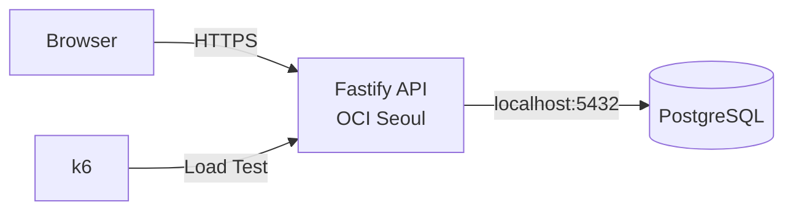

# HourBoard

> **한시간동안 띄워드립니다**
>
> 매 정각 가장 먼저 등록된 한 문구를 한 시간 동안 노출하고, 모든 참가자에게 서버 처리 기준 순위를 반환하는 선착순 동시성 실험 서비스

## Status

**Planning**

현재 저장소는 기획 및 구조 정의 단계다. 애플리케이션 구현은 아직 시작하지 않았다.

## Service Rule

```text
정각
  ↓
여러 사용자가 동시에 등록
  ↓
PostgreSQL이 동일 시간 슬롯을 경쟁 처리
  ↓
1번째 요청 → 전광판 1시간 노출
2번째 이후 → 자신의 처리 순위 반환
```

1등 사용자:

```text
축하합니다!
가장 먼저 등록하셨습니다.
작성하신 문구를 한 시간 동안 띄워드립니다.
```

2등 이후:

```text
아쉽군요!
37번째로 등록하셨습니다!
```

순위는 브라우저 클릭 시각이 아니라 **서버와 PostgreSQL의 처리 결과 기준**이다.

## Why

이 프로젝트는 하나의 시간 슬롯에 여러 요청이 동시에 접근할 때 발생하는 경쟁 상태를 직접 구현하고 검증하기 위해 만든다.

학습 범위:

- Race Condition
- PostgreSQL UPSERT
- Row Contention
- Atomic Counter
- MVCC
- Connection Pool
- Server Time Synchronization
- E2E Concurrency Test
- Load Test
- p50 / p95 / p99 Latency

## Architecture



API와 PostgreSQL은 동일 OCI Compute VM에서 실행한다. 외부 managed database를 사용하지 않는다.

## Tech Stack

| Category | Technology |
| --- | --- |
| Runtime | Node.js 24 LTS |
| Language | TypeScript |
| Backend | Fastify 5.x |
| Database | PostgreSQL 18.x |
| Infrastructure | OCI Compute Always Free |
| Region | Seoul — OCI home region이 Seoul인 계정 기준 |
| Load Test | k6 |

## Repository

```text
hourboard/
├─ .project/
│  └─ plan.md
├─ db/
│  └─ migrations/
├─ docs/
│  ├─ instructions/
│  └─ results/
├─ src/
│  ├─ config/
│  ├─ db/
│  ├─ routes/
│  ├─ schemas/
│  ├─ services/
│  └─ shared/
├─ public/
│  ├─ scripts/
│  └─ styles/
├─ tests/
│  └─ e2e/
│     └─ artifacts/
├─ k6/
│  ├─ scenarios/
│  └─ results/
├─ .gitignore
├─ AGENTS.md
├─ DESIGN.md
└─ README.md
```

## Documents

| Document | Purpose |
| --- | --- |
| `.project/plan.md` | 프로젝트 범위, 동시성 설계, API, Phase, 완료 기준 |
| `AGENTS.md` | 저장소 작업 규칙 |
| `DESIGN.md` | 전광판 UI, 상태, 접근성, 성능 기준 |
| `docs/instructions/*` | 현재 Phase 작업 지침 |
| `docs/results/*` | 완료된 구현·검증 결과 |

## Core Invariant

동일 슬롯에서 N건의 요청이 모두 성공했다면 아래 조건을 만족해야 한다.

```text
winner count = 1
positions = 1..N
duplicate position = 0
missing position = 0
winner message mutation = 0
```

## Repository Metadata

**Repository name**

```text
hourboard
```

**GitHub description**

```text
매 정각 가장 먼저 등록된 한 문구를 한 시간 동안 노출하고, 모든 참가자에게 서버 처리 기준 순위를 반환하는 선착순 동시성 실험 서비스
```

**Topics**

```text
nodejs
typescript
fastify
postgresql
concurrency
race-condition
load-testing
k6
oci
```

## References

- Node.js: https://nodejs.org/en/download/current
- Fastify: https://fastify.dev/docs/latest/
- PostgreSQL Versioning Policy: https://www.postgresql.org/support/versioning/
- OCI Free Tier: https://docs.oracle.com/en-us/iaas/Content/FreeTier/freetier.htm
